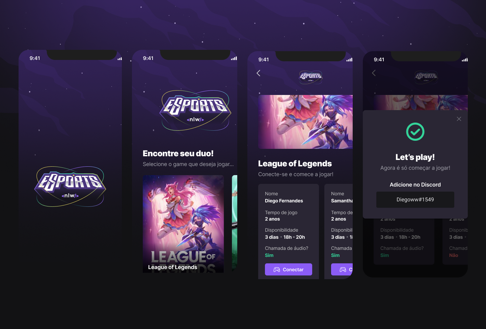

<h1 align="center">
  NLW eSports 💻
</h1>

  
  
  
  

 

  

## 💻 Projeto

O projeto "Find your duo" foi desenvolvido em React Native e realizado na Next Level Week #9 eSports da Rocketseat.

## ✨ Tecnologias

Esse projeto foi desenvolvido com as seguintes tecnologias:

- [React Native](https://reactnative.dev/)
- [Expo](https://expo.dev/)

## Utilização do projeto

### 💾 Baixar o projeto
Faça o clone do repositório para ter uma versão do projeto em sua máquina: 
`$ git clone https://github.com/mmanaclara/nlw-esports-mobile.git`

### 🧰 Instalar dependências
`$ npm install ou yarn`  

### 🚀 Iniciar o projeto
`$ npm run dev ou yarn dev`
 
Agora você pode acessar [`localhost:3000`](http://localhost:3000) do seu navegador.

## 📝 Licença
Este projeto está licenciado nos termos da licença [MIT](https://github.com/mmanaclara/nlw-esports-mobile/blob/main/LICENSE). 